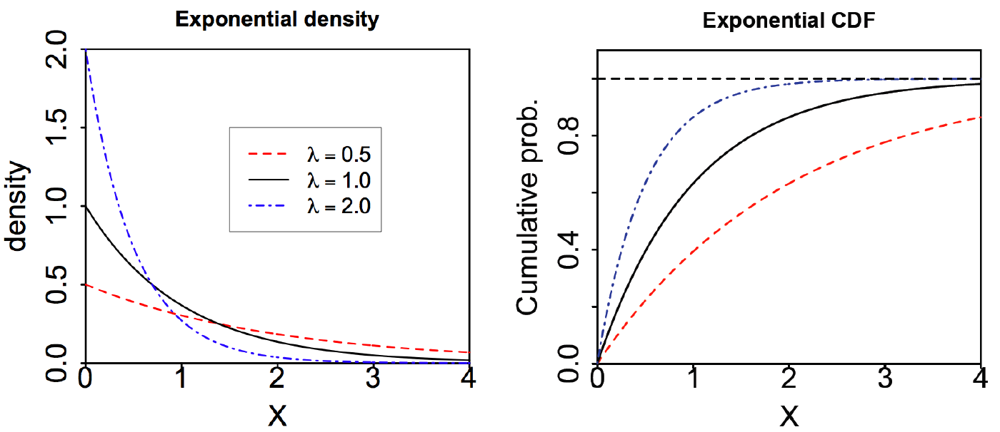

# I. Basic-probability

## Probability vs. Statistics

Probability and statistics are deeply connected because all statistical statements are at bottom statements about probability. Probability is logically self-contained; there are a few rules and answers all follow logically from the rules, though computations can be tricky. In statistics we apply probability to draw conclusions from data. This can be messy and usually involves as much art as science.

Probability focuses on computing the probability of data arising from a parametric model with known parameters. Statistical inference flips this on its head: we will estimate the probability of parameters given a parametric model and observed data drawn from it.

> Example:
>
> * We have a fair coin, calculate the probability of 5 heads in 10 flips
> * There is a coin of unknown provenance, to investigate whether its fair, toss it for 100 times and make estimation based on the observed data

## Counting

**Definition:**

- Experiment: a repeatable procedure with well-defined possible outcomes
- Sample space: the set of all possible outcomes, usually donated by $S$ or $\Omega$
- Event: a subset of the sample space, a collection of outcomes which are disjoint **mutually-exclusive**
- Probability function: a function giving the probability for each outcome

*Mostly, the probability function is unknown, that's why we make assumptions like known distributions or randomly selection*

**Probability for equally probable outcomes:** $\frac{k}{n}$

**Discrete sample space:** listable, can be either finite or infinite

## Conditional Probability and Bayes' Theorem

The conditional probability of A given B:

$P(A|B) = \frac{P(A \cap B)}{P(B)}, P(B) \neq 0$ 

Law of total probability:

$P(A) = P(A|B)P(B) + P(A|B^c)P(B^c)$

Two events A and B are independent if:

$P(A\cap B) = P(A)P(B)$

**Bayes' Theorem:**

$P(B|A) = \frac{P(A|B)P(B)}{P(A)}$

> **Classical Case: The Base Rate Fallacy**
>
> Disease in population $P(D^+) = 0.5\%$, false positive rate $P(T^+|D^-)=5\%$, false negative rate $P(T^-|D^+)=10\%$. Question: $P(D^+|T^+)?$
>$$
> P(D^+|T^+) = \frac{P(D^+ \cap T^+)}{P(T^+)} = \frac{P(T^+|D^+)P(D^+)}{P(T^+|D^+)P(D^+)+P(T^+|D^-)P(D^-)} = 8.3\%
>$$
> *Remark: base rate of the disease in the population is so low that the vast majority of the people taking the test are healthy, and even with an accurate test most of the positives will be healthy people.*
>
> 
>
> **Also see**: [Monty Hall Problem](https://en.wikipedia.org/wiki/Monty_Hall_problem)

**Confusion Matrix**

|                    |    True Null    |  True Non-null  | True Total |
| :----------------: | :-------------: | :-------------: | :--------: |
|   Predicted Null   | True Neg. (TN)  | False Neg. (FN) |     N*     |
| Predicted Non-null | False Pos. (FP) | True Pos. (TP)  |     P*     |
|  Predicted Total   |        N        |        P        |     n      |

- ***FP / N:*** false positive rate, type I error, 1 - specificity
- ***TN / N:*** true negative rate, 1 - type I error, specificity
- ***FN / P:*** false negative rate, type II error
- ***TP / P:*** true positive rate, power, sensitivity, recall
- ***TP / P\*:*** precision, 1 - false discovery proportion
- ***F1 Score:*** 2 * (Precision * Recall) / (Precision + Recall)

[Why F1 is important for imbalance dataset?](https://datascience.stackexchange.com/questions/73974/balanced-accuracy-vs-f1-score)

# II. Discrete Random Variables

## Concepts

**Discrete Random Variable:** Let $\Omega$ be a sample space. A discrete random variable is a function **$X: \Omega \rightarrow R$** that takes a discrete set of values, $X = a$ donates the event $\{\omega | X(\omega) = a\}$. The value depends on a random outcome of an experiment.

**Probability Mass Function (pmf):** $p(a) = P(X=a)$

**Cumulative Distribution Function (cdf):** $F(a) = P(X \le a)$

## Expected Value

$$E(X) = \sum_{j=1}^n p(x_j)x_j$$, measure of the **location** or **central tendency** of a random variable.

- $E(aX+b) = aE(X) + b$
- $E(X+Y) = E(X)+E(Y)$ for any $X$ and $Y$
- $E(h(X)) = \sum_{j} p(x_j)h(x_j)$

> $$
> \begin{align*}
> E(X+Y) &= \sum_i\sum_j (x_i + y_j) p(x_i y_j) = \sum_i\sum_j x_i p(x_i y_j) + \sum_j\sum_i y_j p(x_i y_j) \\
> &= \sum_i x_i p(x_i) + \sum_j y_j p(y_j) = E(X) + E(Y)
> \end{align*}
> $$
> Tip: There is a simple, but **extremely important** idea for counting. It says that if we have a sequence of numbers that are either 0 or 1 then the sum of the sequence is the number of 1s. That means for a very complex problem, maybe it's hard to get the pmf of $X$, but it's possible to split $X$ into $X_1, X_2, ...,X_n$ and sum their expectations. 
>
> Example: [Derangement](https://en.wikipedia.org/wiki/Derangement), $E(X_{return}) = nE(X_i) = 1$

## Variance

$Var(X) = E((X-\mu)^2) = \sum_{i=1}^n p(x_i)(x_j - \mu)^2$, measure of how much the probability mass is spread out around this center.

- $Var(X) = E(X^2) - E(X)^2$
- $Var(aX + b) = a^2Var(X)$
- $Var(X+Y) = Var(X) + Var(Y)$ if X and Y are independent

## Distributions

### Bernoulli Distribution

- $X$ takes 1 or 0
- $P(X = 1) = p$ and $P(X = 0) = 1 - p$

Notation: $X \sim Bernoulli(p)$ or $X \sim Ber(p)$

$$E(X) = p$$

$Var(X) = (1-p)p$

### Binomial Distribution

The number of success in $n$ **independent** Bernoulli trails.

Notation: $X \sim Binomial(n, p)$

$$E(X) = \sum_j E(X_j) = \sum_j p = np$$

$Var(X) = \sum_j Var(X_j) = n(1-p)p$

### Geometric Distribution

$X \sim Geometric(p)$: $p(k) = P(X=k) = (1-p)^k p$

The number of tails before the first success in a sequence of Bernoulli trials.

$E(X) = \frac{1-p}{p}$

> We know $\sum_{k=0}^\infin x^k = \frac{1}{1-x}$, take differentiate $\sum_{k=0}^\infin kx^{k-1} = \frac{1}{(1-x)^2}$
> 
> $E(X) = \sum_{k=0}^\infin k(1-p)^k p = p(1-p)\sum_{k=0}^\infin k(1-p)^{k-1} = \frac{1-p}{p}$

$Var(X) = \frac{1-p}{p^2}$
> $$ Var(X) = E(X^2) - E(X)^2 = \sum_{k=0}^\infin k^2 (1-p)^k p - \frac{(1-p)^2}{p^2} $$
>
> Hint: $\sum_{k=0}^\infin k(k-1)x^{k-2} = \frac{2}{(1-x)^3}$

**Geometric is memoryless:** $P(X = n + k | X \ge n) = P(X = k)$, e. g. Gambler's fallacy

### Uniform Distribution

$X \sim uniform(n)$: $P(x_i) = \frac{1}{n}$

$E(X) = \frac{n+1}{2}$

$Var(X) = E(X^2) - E(X)^2 = \sum_{k=1}^n k^2/n - (\frac{n+1}{2})^2 = \frac{n^2 -1}{12}$

> Hint: $\sum_{k=1}^n k^2 = \frac{n(n+1)(2n+1)}{6}$

### Poisson Distribution

$X \sim Poisson(\lambda): P(X=k) = \frac{e^{-\lambda}\lambda^k}{k!}$

$E(X) = Var(X) = \lambda$

> **Relationship with binomial distribution:** for binomial distribution, $p(k) = C_n^k p^k(1-p)^{n-k}$, if we know average success time is $\lambda$ in a period of time, then we split it into n intervals, for 1 interval, $p=\lambda/n$
>
> $p(k)=C_n^k (\lambda/n)^k(1-\lambda/n)^{n-k} = e^{-\lambda} \frac{n!}{(n-k)!k!} (\frac{\lambda}{n-\lambda})^k =\frac{\lambda^k}{k!}e^{-\lambda}$

### About e

Definition: $e = \lim_{n\to \infin} (1+1/n)^n$

Also we know $(1+1/n)^n = \sum_{k=0}^n C_n^k1/n^k = \sum_{k=0}^n[\frac{1}{k!}\frac{n!}{(n-k)!n^k}]$

So $e=\sum_{n=0}^\infin \frac{1}{n!}$

Then $(1+x/n)^n = [(1+\frac{1}{n/x})^{n/x}]^x = e^x = 1+x+\frac{x^2}{2!}+\frac{x^3}{3!}...$

# III. Continuous Random Variables

## Concepts

A random variable $X$ is continuous if there is a function $f(x)$ such that for any $c \le d$ we have $P(c \le X \le d) = \int_c^d f(x) dx$, the function $f(x)$ is **probability density function (pdf)**

**Cumulative distribution function (cdf):** $F(b) = P(X \le b) = \int_{-\infin}^b f(x)dx$

## Expected Value

$E(X) = \int_a^b x f(x) dx$, the units of $f(x)$ are $prob/(unit\ of\ X)$ 

- $E(X+Y) = E(X) + E(Y)$
- $E(aX+b) = aE(X) +b$
- $E(Y) = E(h(X)) = \int_{-\infin}^\infin h(x)f_X(x) dx$

## Transformations

### Transform cdf

$y = h(x), x = h^{-1}(y)$

$F_Y(y) = P(Y \le y) = P(h(X) \le y) = P(X \le h^{-1}(y)) = F_X(h^{-1}(y))$ *but direction depends on $h(x)$*

### Transform pdf

Probability is given by $\int f_X(x) dx$, $\frac{dy}{dx} = h'$

>Assume $X \sim N(\mu, \sigma), Z = \frac{X - \mu}{\sigma}$
>$$
>f_X(x) dx= \frac{1}{\sigma \sqrt{2 \pi}}e^{-(x-\mu)^2/2\sigma^2}dx = >\frac{1}{\sigma \sqrt{2 \pi}}e^{-z^2/2} (\sigma dz) = \frac{1}{\sqrt{2\pi}}e^{-z^2/2} dz = f_Z(z) dz
>$$
>So $Z \sim N(0,1)$

## Distributions

*(Review reading materials 5b for more variance calculation)*

### Uniform Distribution

$X \sim uniform(a, b)$ or $U(a, b)$, $f(x) = \frac{1}{b-a}$ for $a \le x \le b$

$E(X) = \int_a^b \frac{x}{b-a} dx = \frac{b+a}{2}$

### Exponential Distribution

$X \sim exponential(\lambda)$ or $exp(\lambda)$

**pdf:** $f(x) = \lambda e ^{-\lambda x}$ for $0 \le x$

**cdf:** $F(x) = 1- e ^{-\lambda x}$ for $0 \le x$

> **Relationship with geometric distribution:** In geometric distribution, $p(k) = (1-p)^k p$ for n Bernoulli trials; if we split a whole continuous process into n tiny trials, let $\lambda$ equals to average success in 1 unit time, then $p = \frac{\lambda}{n}$. 
>
> $P(X > x) = (1-p)^{xn} = ((1 - \frac{\lambda}{n})^n)^x = e^{-\lambda x}$ (Survival function)

$E(X) = \frac{1}{\lambda}$, $Var(X) = E(X^2) - E(X)^2 = \frac{2}{\lambda^2} - \frac{1}{\lambda^2} = \frac{1}{\lambda^2}$

> Let $u = x, v' = \lambda e ^{-\lambda x} \ \Rightarrow u'=1, v=-e ^{-\lambda x}$
> $$
\begin{align*}
E(X) &= \int_0^\infin x \lambda e ^{-\lambda x} dx = -x  e ^{-\lambda x}|_0^\infin + \int_0^\infin  e ^{-\lambda x} dx \\
&= 0 - \frac{e ^{-\lambda x}}{\lambda}|_0^\infin = \frac{1}{\lambda}
\end{align*}
> $$

**Memorylessness:** $P(X > s+t|X>s) = P(X>t)$

### Normal Distribution

$X \sim Normal(\mu, \sigma^2), N(\mu, \sigma^2)$

**pdf:** $f(x) = \frac{1}{\sigma \sqrt{2 \pi}}e^{-(x-\mu)^2/2\sigma^2}$

For standard normal distribution, $\phi(z) = \frac{1}{\sqrt{2 \pi}}e^{-z^2/2}$

Rule of thumb: with 1-2-3 $\sigma$, $p \approx 68\%, 95\%, 99\%$

> $$
> E(Z) = \int_{-\infin}^{\infin}z\frac{1}{\sqrt{2 \pi}}e^{-\frac{z^2}{2}} dz = -\frac{1}{\sqrt{2 \pi}}e^{-\frac{z^2}{2}} |_{-\infin}^{\infin} = 0
> $$

### Pareto Distribution

$X \sim Pareto(m, \alpha)$

**pdf:** $f(x) = \frac{\alpha m^\alpha}{x^{\alpha +1}}$, **cdf:** $F(x) =1 - \frac{m^\alpha}{x^{\alpha}}$ for $x \ge m$

> $m$ is the minimum possible value of $x$ which provides the scale, $\alpha$ provides shape
>
> Log the survival function, we can get $ln(F(X>x)) = -\alpha (ln(x) - ln(m)) $

Models: The Pareto distribution models a power law, where the probability that an event occurs varies as a power of some attribute of the event, such as the size of meteors, income levels across a population, and population levels across cities. [Pareto principle](https://en.wikipedia.org/wiki/Pareto_principle) "80-20 rule".

# IV. Law of Large Numbers and Central Limit Theorem

## Definition

**Law of large numbers:** Suppose $X_1, X_2, ..., X_n$ are *independent and identically-distributed* (**i.i.d.**) with same mean $\mu$ and standard deviation $\sigma$, then $\bar{X}_n = \frac{1}{n} \sum_{i}^n X_i$ (note that $\bar{X}_n$ itself is a random variable). For any $a>0$, we have
$$
\lim_{n\to \infin} P(|\bar{X}_n - \mu| < a) = 1
$$
**LoLN for histograms:** With high probability the density histogram of a large number of samples from a distribution is a good approximation of the graph of the underlying pdf $f(x)$.

**Central limit theorem:** 
$$
S_n = \sum_{i=1}^n Xi,\ E(S_n)=n\mu,\ Var(S_n)=n\sigma^2 \\ 
\bar{X}_n=\frac{S_n}{n},\ E(\bar{X}_n)=\mu,\ Var(\bar{X}_n)=\frac{\sigma^2}{n} \\
Z_n = \frac{S_n - n\mu}{\sigma\sqrt{n}} = \frac{\bar{X}_n - \mu}{\sigma/\sqrt{n}}
$$
For large n,
$$
\bar{X}_n \sim N(\mu, \sigma^2/n),\ S_n \sim N(n\mu, n\sigma^2),\ Z \sim N(0, 1)
$$

> Example: Polling
>
> For 2 candidates polling from n people, the margin of error is $\pm 1/\sqrt{n}$
>
> Because $\bar{X}_n \sim N(p_0, p_0(1-p_0)/n)$, $\sigma = \sqrt{p_0(1-p_0)}$, then 95% confidence interval should be within $2\sigma/\sqrt{n}$ of the true mean $p_0$, we know $\sigma = \sqrt{p_0(1-p_0)} \le 1/2$, then $2\sigma/\sqrt{n} \le 1/\sqrt{n}$

**Why we need CLT?** In real world, the distribution of the $X_i$ may not be familiar, or may not even be known, so you will not be able to compute the probabilities for $S_n$ exactly. It can also happen that the exact computation is possible in theory but too computationally intensive in practice. (If n is very big, even binomial distribution is hard to compute, but binomial can be closely approximated by normal distribution.)

## Proof

**Chebyshev inequality:** assume mean is 0
$$
\begin{align*}
P(|Y| \ge a) &= \int_{-\infin}^{-a}f(y)dy + \int_{a}^{\infin}f(y)dy \le \int_{-\infin}^{-a}\frac{y^2}{a^2}f(y)dy + \int_{a}^{\infin}\frac{y^2}{a^2}f(y)dy \\
&\le \int_{-\infin}^{\infin}\frac{y^2}{a^2}f(y)dy = \frac{Var(Y)}{a^2}
\end{align*}
$$
So $P(|Y - \mu| \ge a) \le \frac{Var(Y)}{a^2}$, consider $Var(\bar{X}_n) = Var(X)/n$, when n goes to infinity, $P(|Y - \mu| \ge a) \le 0$

# V. Joint Distributions

For discrete random variables, $\sum_{i=1}^n\sum_{j=1}^m p(x_i, y_j) = 1$

For continuous random variables, $\int_c^d \int_a^b f(x, y)dx dy = 1$

**Joint cumulative distribution function:** $F(x, y) = P(X \le x, Y \le y) = \int_c^y \int_a^x f(u,v)dudv$

## Marginal distributions

For discrete random variables, $p_X(x_i) = \sum_jp(x_i, y_j),\ p_Y(y_j) = \sum_ip(x_i, y_j)$

For continuous random variables, $f_X(x) = \int_c^d f(x, y)dy,\ f_Y(y) = \int_a^b f(x, y)dx$

For marginal cdf, $F_X(x)=F(x, d), F_Y(y) = F(b, y)$

**Independence:** $F(X, Y) = F_X(x)F_Y(y)$

## Covariance

**Definition:** Suppose $X$ and $Y$ are random variables with means $\mu_X$ and $\mu_Y$. The covariance of $X$ and $Y$ is defined as $Cov(X, Y) = E((X-\mu_X)(Y-\mu_Y))$

**Properties:**

* $Cov(X,Y) = E(XY) - \mu_X \mu_Y$
* $Var(X+Y) = Var(X)+Var(Y)+2Cov(X, Y)$
* $Cov(X,X) = Var(X)$
* $Cov(X_1 + X_2, Y) = Cov(X_1, Y) + Cov(X_2, Y)$
* $Cov(aX+b, cY+d) = acCov(X, Y)$
* If $X$ and $Y$ are independent then $Cov(X,Y)=0$

> Warning: The converse is false, zero covariance does not always imply independence. Covariance is 0 only means X and Y don't have linear relationship, but if $Y = X^2$ then Covariance is 0 but they are not independent.

## Correlation

$$
Cor(X, Y) = \rho = \frac{Cov(X, Y)}{\sigma_X \sigma_Y} = Cov(\frac{X}{\sigma_X}, \frac{Y}{\sigma_Y})
$$

**Properties:**

* $\rho$ is the covariance of the standardizations of X and Y
* $\rho$ is dimensionless
* $\rho = \pm 1$ when $Y = aX +b$ (so correlation can completely miss higher order relationships.)

> $-1 \le \rho \le 1$ because
>
> * $0 \le Var(\frac{X}{\sigma_X}+ \frac{Y}{\sigma_Y}) = 2 + 2\rho \Rightarrow \rho \ge -1$
> * $0 \le Var(\frac{X}{\sigma_X} - \frac{Y}{\sigma_Y}) = 2 - 2\rho \Rightarrow \rho \le 1$
>
> If $\rho = 1$, then $0 = Var(\frac{X}{\sigma_X} - \frac{Y}{\sigma_Y}) \Rightarrow \frac{X}{\sigma_X} - \frac{Y}{\sigma_Y} = c$

# VI. Basic-statistics

Three phases: collecting data, describing data, analyzing data. We make hypotheses about what's true, collect data in experiments, describe the results, and then infer from the results the strength of the evidence concerning our hypotheses.

* Probability is more theoretical, focusing on assumed fully known random process and calculate following probabilities theoretically. The precondition is, we already know the population or we have assumption on that.
* Statistics is more practical, focusing on drawing inference from the observed data. We can assume the population follow specific kind of distribution, we have to infer the parameters using samples we have.

## Statistic

**Definition:** A statistic is anything that can be computed from the collected data, which itself is a random variable because new experiment will produce new data.

> Example: the probability of rolling a 6 is not a statistic, whether or not the die is truly fair. Rather this probability is a property of the die (and the way we roll it) which we can estimate using the data. Such an estimate is given by the statistic *proportion of the rolls that were 6*.

* Point statistics: a single value computed from data, such as the sample average or the sample standard deviation
* Interval statistics: an interval $[a: b]$ computed from the data.

## Maximum Likelihood Estimates

In practice, we usually assume the data arising from a parametric model with unknown parameters. To estimate the unknown parameter, one method is **maximum likelihood estimate**, which makes observed data have the biggest probability.

**Definition:** Given data the maximum likelihood estimate (MLE) for the parameter $p$ is the value of $p$ that maximizes the likelihood $P(data|p)$. That is, the MLE is the value of $p$ for which the data is most likely.

> Example: A coin is flipped 100 times. Given that there were 55 heads, find $p$ of head
>
> $P(55 heads)=C_{100}^{55}p^{55}(1-p)^{45}=P(55heads|p)$
>
> To find the MLE of $p$, $\frac{d}{dp}P(data|p) = 0$, then $\hat{p} = 0.55$
>
> *To make sure $\hat{p}$* is maximum, still need to check $p=0\ or\ 1$

## Log Likelihood

If is often easier to work with the natural log of the likelihood function. Since $ln(x)$ is an increasing function, the maxima of the likelihood and log likelihood coincide.

> Example1: Assume bulb light lifetime is modeled by exponential distribution and we got 5 data 2, 3, 1, 3, 4 years. Find MLE for $\lambda$
> $$
> f(x_1, x_2, x_3, x_4, x_5|\lambda) = \lambda^5 e^{-(x_1+ x_2+ x_3+ x_4+ x_5)\lambda}
> $$
> Then $f(2, 3, 1, 3, 4|\lambda) = \lambda^5 e^{-13\lambda}$, $ln(f(2, 3, 1, 3, 4|\lambda)) = 5ln(\lambda)-13\lambda$
> $$
> \frac{d}{d\lambda}(log\ likelihood) = \frac{5}{\lambda} - 13 =0 \Rightarrow \hat{\lambda} = \frac{5}{13}
> $$
> Example2: Normal distributions
> $$
> f_{X_i}(x_i) = \frac{1}{\sigma\sqrt{2\pi}}e^{-\frac{(x_i-\mu)^2}{2\sigma^2}},\\ ln(f(x_1,..., x_n|\mu, \sigma)) = -nln(\sqrt{2\pi})-nln(\sigma)-\sum_{i=1}^n \frac{(x_i-\mu)^2}{2\sigma^2}
> $$
> Then
> $$
> \frac{\part{ln(f(x_1,..., x_n|\mu, \sigma))}}{\part{\mu}} = \sum_{i=1}^n \frac{(x_i-\mu)}{\sigma^2} = 0 \Rightarrow \hat{\mu} = \frac{\sum_{i=1}^n x_i}{n} = \bar{x}
> $$
>
> $$
> \frac{\part{ln(f(x_1,..., x_n|\mu, \sigma))}}{\part{\sigma}} = -\frac{n}{\sigma}+\sum_{i=1}^n \frac{(x_i-\mu)^2}{\sigma^3} = 0 \Rightarrow \hat{\sigma}^2 = \frac{\sum_{i=1}^n (x_i - \mu)^2}{n}
> $$
>
> *Why use pdf here? Actually we can add $dx$ back to the likelihood function, but the $dx$ won't affect the MLE*

## MLE Properties

* **Asymptotically unbiased**: as the amount of data grows, the mean of the MLE converges to $p$, $E(\hat{p_n}) \rightarrow p\ as \ n \rightarrow \infin$
* **Asymptotically minimal variance:** as the amount of data grows, the MLE has the minimal variance among all unbiased estimators of $p$. In symbols: for any unbiased estimator $\tilde{p_n}$ and $\epsilon >0$ we have that $Var(\tilde{p_n}) + \epsilon > Var(\hat{p_n})$ as $n \to \infin$

# VII. Bayesian Updating

$$
P(H|D) = \frac{P(D|H)P(H)}{P(D)}
$$

* **Data:** the result of our experiment
* **Hypotheses:** the result we want to test
* **Prior probability:** the probability of each hypotheses prior to the experiment, e.g. $P(H)$
* **Likelihood:** the probability of data assuming the hypothesis is true, e.g. $P(D|H)$
* **Posterior probability:** the probability (posterior to) of each hypothesis given the data, e.g. $P(H|D)$
* **Bayesian updating:** the process of going from the prior probability $P(H)$ to the posterior $P(H|D)$

|            | Hypothesis |       Prior        |  Likelihood   |        Bayes numerator        |      Posterior       |
| :--------: | :--------: | :----------------: | :-----------: | :---------------------------: | :------------------: |
|            |    $H$     |       $P(H)$       |   $P(D|H)$    |         $P(D|H)P(H)$          |       $P(H|D)$       |
|  Discrete  |  $\theta$  |    $p(\theta)$     | $p(x|\theta)$ |    $p(x|\theta)p(\theta)$     |    $p(\theta|x)$     |
| Continuous |  $\theta$  | $f(\theta)d\theta$ | $p(x|\theta)$ | $p(x|\theta)f(\theta)d\theta$ | $f(\theta|x)d\theta$ |

*What's the difference with MLE?* We don't know **Prior** in MLE

## Discrete priors

If we update again and again,

>  $\sum BN_1 = p(x_1= 1), \sum BN_2 = p(x_1= 1 \cap x_2= 1| \theta)p(\theta) = p(x_1= 1 \cap x_2= 1)$

### Predictive Probabilities

**Probabilistic prediction** simply means assigning a probability to each possible outcomes of
an experiment.

**Prior predictive probabilities:** These probabilities give a probabilistic prediction of what will happen after the experiment, which are calculated before collecting data

**Posterior predictive probabilities:** These probabilities give a probabilistic prediction of what will happen after the experiment again, which are computed after collecting data and updating the prior to the posterior

> *Example:*
>
> $P(D_1) = \sum prior \cdot likelihood = \sum p(x_1|\theta)p(\theta)$, 
>
> $P(D_2|D_1) = \sum post \cdot likelihood = \sum p(x_2|\theta)p(\theta|x_1) = \sum p(x_2|\theta) p(x_1|\theta)p(\theta)/p(x_1)$

Each hypothesis gives a different probability of heads, so the total probability of heads is a weighted average. For the prior predictive probability of heads, the weights are given by the prior probabilities of the hypotheses. For the posterior predictive probability of heads, the weights are given by the posterior probabilities of the hypotheses. Remember: **Prior and posterior probabilities** are for **hypotheses**. Prior predictive and posterior predictive probabilities are for data. 

### Odds

$O(E) = \frac{P(E)}{P(E^c)}$. For odds updating, one of our key points will be that the data can provide evidence supporting or negating a hypothesis depending on whether its posterior odds are greater or less than
its prior odds.

**Example:** Marfan syndrome

The prior odds: $O(M) = P(M)/P(M^c) = 1/14999 = 0.000067$

If a person has at least one of these ocular features, the posterior adds:

$O(M|F) = \frac{P(M|F)}{P(M^c|F)} = \frac{P(F|M)P(M)}{P(F|M^c)P(M^c)} = 0.000667$

### Bayes factors and strength of evidence

For a hypothesis H and data D, the Bayes factor is the ratio of the likelihoods:

**Bayes factor** $= \frac{P(D|H)}{P(D|H^c)}$

$O(H|D) = \frac{P(H|D)}{P(H^c|D)} = \frac{P(D|H)P(H)}{P(D|H^c)P(H^c)} = \frac{P(D|H)}{P(D|H^c)}  O(H)$

So posterior odds = **Bayes factor** * prior odds

> Example: Two traces of blood, O(60% in population) and AB(1% in population), left at the scene of a crime. Alan has O blood, Bob has AB blood. How's the evidence of data in terms of 2 people's suspicion?
>
> $BF_A = \frac{P(D|H_A)}{P(D|H_A^c)} = \frac{0.01}{2 \times0.6\times0.01}=0.83 <1$
>
> $BF_B = \frac{P(D|H_B)}{P(D|H_B^c)} = \frac{0.6}{2 \times0.6\times0.01}=50\gg1$

### Bayes factors updating

**Conditionally independent:** $P(D_1, D_2|H) = P(D_1|H)P(D_2|H)$ if holds for every hypothesis.

So $O(H|D_1, D_2) = \frac{P(D_1, D_2|H)}{P(D_1, D_2|H^c)}O(H) = BF_2 \cdot BF_1 \cdot O(H)$

**Log odds:** $ln(O(H|D_1, D_2)) = ln(BF_2)+ ln(BF_1) + ln(O(H))$

## Continuous Priors

**Law of total probability:** $p(x) = \int_a^b p(x|\theta) f(\theta)d\theta$

**Bayes theorem:** $f(\theta|x) = \frac{p(x|\theta)f(\theta)}{p(x)} = \frac{p(x|\theta)f(\theta)}{\int_a^b p(x|\theta) f(\theta)d\theta}$

### Continuous updating

**Example:** A bent coin with unknow probability $\theta$ of heads. The value of $\theta$ is random with prior pdf $f(\theta) = 2\theta$.

### Predictive probabilities

**Followed example:**

Prior predictive probability: $p(x_1=1) = \int_0^1 p(x_1=1|\theta) f(\theta) d\theta = \frac{2}{3}$

Posterior predictive probability: 

$p(x_2=1|x_1=1) = \int_0^1 p(x_2=1|\theta, x_1=1) f(\theta|x_1=1) d\theta = \int_0^1 \theta \cdot3\theta^2d\theta = 3/4$

### Continuous Data with Continuous Priors

*Here we usually drop $dx$ because data $x$ is fixed in each calculation.*

**Example:** Normal hypothesis and normal data

Suppose $x \sim N(\theta, 1)$ and $\theta \sim N(2, 1)$, we draw a $x$ with value 5.

Here we don't need to really calculate $c_1 c_2$, because the posterior pdf is still normal. We can infer that $\mu = 7/2$ and $\sigma^2=1/2$ 

**Prior predictive pdf:** $\phi(x) = \int \phi(x|\theta)f(\theta)d\theta$

**Posterior predictive pdf:**  $\phi(x_2|x_1) = \int \phi(x_2|\theta, x_1)f(\theta|x_1)d\theta = \int \phi(x_2|\theta)f(\theta|x_1)d\theta$

> Because $x_1$ and $x_2$ are **conditionally independent**,
>
> $\phi(x_2|\theta, x_1) = \frac{\phi(x_1,x_2|\theta)f(\theta)}{\phi(x_1|\theta)f(\theta)} = \phi(x_2|\theta)$

## Conjugate priors

### Beta distribution

$f(\theta) = \frac{(a+b-1)!}{(a-1)!(b-1)!} \theta^{a-1}(1-\theta)^{b-1}$

**Example:** If a bent coin ~ $Bernoulli(\theta)$, $f(\theta)=1$, We toss it 12 times and get 8 heads and 4 tails.

If toss this coin again getting n heads and m tails, then $f(\theta|x_1, x_2) \sim Beta(9+n, 5+m)$

The beta distribution is called a **conjugate prior** for the binomial distribution. This means that if the likelihood function is binomial, then a beta prior gives a beta posterior. In fact, the beta distribution is a conjugate prior for the Bernoulli and geometric distributions as well.

*The flat prior is actually $Beta(1, 1)$*

Suppose the likelihood follows a $binomial(N, \theta)$ distribution:

### Normal distribution

The normal distribution is its own conjugate prior. In particular, if the likelihood function is **normal with known variance**, then a normal prior gives a normal posterior.

Suppose a measurement $x\sim N(\theta, \sigma^2)$ where the variance is known, for the unknown parameter $\theta$ we have $f(\theta) \sim N(\mu_{prior}, \sigma^2_{prior})$, then:

The posterior pdf is also normal $f(\theta|x) \sim N(\mu_{post}, \sigma^2_{post})$ where
$$
\frac{1}{\sigma^2_{post}} = \frac{1}{\sigma^2_{prior}}+\frac{1}{\sigma^2},\ \frac{\mu_{post}}{\sigma^2_{post}} = \frac{\mu_{prior}}{\sigma^2_{prior}} + \frac{x}{\sigma^2}
$$
The above equations can be written as:
$$
a=\frac{1}{\sigma^2_{prior}}, b=\frac{1}{\sigma^2}, \mu_{post} = \frac{a\mu_{prior} + bx}{a+b}, \sigma^2_{post} = \frac{1}{a+b}
$$
So that $\mu_{post}$ is a weighted average between $\mu_{prior}$ and the data $x$. If b is very large (that is, if the data has a tiny variance) then most of the weight is on the data. If a is very large (that is, if you are very confident in your prior) then most of the weight is on the prior. (the post variance is smaller than both data variance and prior variance)

If we get multi data points, 
$$
\frac{1}{\sigma^2_{post}} = \frac{1}{\sigma^2_{prior}}+\frac{n}{\sigma^2},\ \frac{\mu_{post}}{\sigma^2_{post}} = \frac{\mu_{prior}}{\sigma^2_{prior}} + \frac{n\bar{x}}{\sigma^2},\ \bar{x} = \frac{x_1+...+ x_n}{n} \\

a=\frac{1}{\sigma^2_{prior}}, b=\frac{n}{\sigma^2}, \mu_{post} = \frac{a\mu_{prior} + b\bar{x}}{a+b}, \sigma^2_{post} = \frac{1}{a+b}
$$

- Normal-normal: variance always decreases with data.
- Beta-binomial: variance usually decreases with data. (might increase)

## Choosing priors

**Bayesian**: Bayesians make inferences using the posterior $P(H|D)$, and therefore always need a prior $P(H)$. If a prior is not known with certainty the Bayesian must try to make a reasonable choice. 

**Frequentist**: Very briefly, frequentists do not try to create a prior. Instead, they make inferences using the likelihood $P(D|H)$.

Benefits of Bayesian:

- The posterior probability $P(H|D)$ for the hypothesis given the evidence is usually exactly what we'd like to know. The Bayesian can say something like '*the parameter of interest has probability 0.95 of being between 0.49 and 0.51.*' (more intuitive)
- The assumptions that go into choosing the prior can be clearly spelled out.

## Probability intervals

A p-probability interval for $\theta$ is an interval $[a,b]$ with $P(a\le\theta\le b) =p$. Here we can call it probability interval or credible interval, but not confidence interval.

# VIII. Frequentist

## Comparison

**Frequentist** refers to the idea that probabilities represent long-term frequencies of repeatable random experiments. This means the frequentist finds it **nonsensical to specify a probability distribution for a parameter with a fixed value**. While Bayesians are happy to use probability to describe their **incomplete knowledge of a fixed parameter**, frequentists reject the use of probability to quantify degree of belief in hypotheses.

**Bayesians** put probability distributions on everything (hypotheses and data), while frequentists put probability distributions on (random, repeatable, experimental) data given a hypothesis. For the frequentist when dealing with data from an unknown distribution only the likelihood has meaning. The prior and posterior do not.

- **Statistic**: anything that can be computed from data.
- **Sampling distribution**: the probability distribution of a statistic

> [Likelihood Principle](https://en.wikipedia.org/wiki/Likelihood_principle): if the data are the same in both cases, the inferences drawn about the value of $\theta$ should also be the same. That true in Bayes but not in frequentist. Because the outcome of frequentist depends on the experimental procedure, it uses the probabilities of unseen data as well as those of the actually observed data.
>
> *Different stop rule can cause different result in NHST even we got same experiment data. Because the likelihood function depends on the experiment design which can derive different distributions.*

### Bayesian

**Critique of Bayesian:**

1. Different people will produce different priors and may therefore arrive at different posteriors and conclusions.
2. There are philosophical objections to assigning probabilities to hypotheses, as hypotheses do not constitute outcomes of repeatable experiments in which one can measure long-term frequency.

**Defense of Bayesian:**

1. The probability of hypotheses is exactly what we need to make decisions.
2. Using Bayes' theorem is logically rigorous. Once we have a prior all our calculations have the certainty of deductive logic.
3. The evidence derived from the data is independent of notions about *data more extreme* that depend on the exact experimental setup
4. Data can be used as it comes in. There is no requirement that every contingency be planned for ahead of time.

### Frequentist

**Critique of frequentist:**

1. It is ad-hoc and does not carry the force of deductive logic. Notions like *data more extreme* are not well defined. The p-value depends on the exact experimental setup
2. Experiments must be fully specified ahead of time.
3. The p-value and significance level are notoriously prone to misinterpretation. E.g. the significant level is 5% means if the null hypothesis is true then 5% of the time it will be rejected due to randomness.

**Defense of frequentist:**

1. It is objective
2. Frequentist experimental design demands a careful description of the experiment and methods of analysis before starting. This helps control for experimenter bias.

## Null Hypothesis Significance Testing

- $H_0$: the null hypothesis, usually a cautious default assumption for the model generating the data.
- $H_A$: the alternative hypothesis, which is extreme under the null hypothesis
- $X$: the test statistic computed from the data, which is a random variable can be get from a repeatable trial
- Null distribution: the probability distribution of $X$ assuming $H_0$
- Simple hypothesis: which we can specify its distribution completely. A typical simple hypothesis is that a parameter of interest takes a specific value.
- Composite hypotheses: If its distribution cannot be fully specified, we say that the hypothesis is composite. A typical composite hypothesis is that a parameter of interest lies in a range of values.
- Significance level: $P(reject\ H_0|H_0) = P(Type\ I\ error)$
- Power: $P(reject\ H_0|H_a) = 1-P(Type\ II\ error)$

We could only say *reject* or *not reject* the null hypothesis, whereas *accept* $H_0$ is wrong. This is often summarized by the statement: *you can never prove the null hypothesis*. A **significance level** of 0.05 does not mean the test only makes mistakes 5% of the time. It means that if the null hypothesis is true, then the probability the test will mistakenly reject it is 5%.

> If $H_0$ true, then the data show reject or non-reject $H_0$; but the reverse is not right, because if A then B can only derive if not B then not A

### Design a NHST

1. Clarify $H_0$ and $H_A$
2. Design an experiment to collect data and choose a test statistic $x$ to be computed from the data. The key requirement here is to know the null distribution $f(x|H_0)$. To compute power, one must also know the alternative distribution $f(x|H_A)$.
3. Decide if $H_A$ one-sided or two-sided
4. Choose a significance level $\alpha$ for rejecting the null hypothesis. If applicable, compute the corresponding power of the test.
5. Run the experiment to collect data $x_1, x_2, ..., x_n$
6. Compute the test statistic $x$
7. Compute the p-value corresponding to $x$ using the null distribution
8. If $p<\alpha$, reject the null hypothesis in favor of the alternative hypothesis

**p-value** is the probability, assuming the null hypothesis, of seeing data at least as extreme as the experimental data. Depends on one-sided or two-sided.

$p = P(data\ at\ least\ as\ extreme\ as\ what\ we\ got|H_0)$

**The main purpose of significance testing is to use sample statistics to draw conclusions about population parameters. **

## Z-test

* Use: Test if the population mean equals a hypothesized mean.
* Data: $x_1, x_2, ..., x_n \sim N(\mu, \sigma)$, where **$\mu$ is unknown and $\sigma$ is known**
* Test statistic: $z = \frac{\bar{x} - \mu_0}{\sigma/\sqrt{n}}$ which is the standardized mean
* Null hypothesis: $f(z|H_0)$ follows the pdf $Z \sim N(0, 1)$
* $p = P(Z>z|H_0)$ or $p = P(Z<z|H_0)$ or $p = P(|Z| > |z|)$

## T-test

The [t-distribution](https://en.wikipedia.org/wiki/Student's_t-distribution) is symmetric and bell-shaped like the normal distribution. It has a parameter $df$ which stands for degrees of freedom. For df small the t-distribution has more probability in its tails than the standard normal distribution. As df increases $t(df)$ becomes more and more like the standard normal distribution.

### One-sample t-test

For z-test, we know the variance $\sigma^2$. However mostly we don't know $\sigma$ and we have to estimate that.

* Use: Test if the population mean equals a hypothesized mean.
* Data: $x_1, x_2, ..., x_n \sim N(\mu, \sigma)$, where **$\mu$ and $\sigma$ are both unknown**
* Test statistic: $t = \frac{\bar{x} - \mu_0}{s/\sqrt{n}}$ which is the studentized mean, sample variance $s^2 = \sum_{i=1}^n(x_i-\bar{x})^2 / (n-1)$
* Null hypothesis: $f(t|H_0)$ follows the pdf $T\sim t(n-1)$, the t-distribution with n-1 degrees of freedom

>T-distribution can be defined as $T=\frac{Z}{\sqrt{V/v}}$, where $Z\sim N(0,1)$, $V$ follows chi-squared distribution with $v \ df$, and they are independent.
>
>Then let $V=(n-1)\frac{S_n^2}{\sigma^2}, Z=\frac{\bar{X_n}-\mu}{\sigma/\sqrt{n}}$, we'll get $T=\frac{\bar{X_n}-\mu}{S_n/\sqrt{n}}$

### Two-sample t-test

* Use: Test if the population means from **two populations** differ by a hypothesized amount.
* Data: Assume 2 normal distributions have **same variance**, $x_1, x_2, ..., x_n \sim N(\mu_1, \sigma)$, $y_1, y_2, ..., y_m \sim N(\mu_2, \sigma)$, where **$\mu_1$, $\mu_2$ and $\sigma$ are all unknown**
* $H_0$: For a specific $\mu_0: \mu_x - \mu_y = \mu_0$
* Test statistic: $t = \frac{\bar{x}-\bar{y} - \mu_0}{s_p}$, the pooled variance $s_p^2 = \frac{(n-1)s_x^2+(m-1)s_y^2}{n+m-2}(\frac{1}{n}+\frac{1}{m})$, if $n=m$, $s_p^2 = \frac{s_x^2 + s_y^2}{n}$ 
* Null hypothesis: $f(t|H_0)$ follows the pdf $T\sim t(n+m-2)$

*when the variances are not assumed equal, use Welch's t-test.*

> In fact, there are other significance tests that test whether the data is approximately normal ([Shapiro-Wilk test](https://en.wikipedia.org/wiki/Shapiro%E2%80%93Wilk_test)) and whether the two groups have the same variance (**F-test**). In practice one might apply these first to determine whether a t test is appropriate in the first place.

### Paired two-sample t-test

* Use: Test if the average difference between paired values in a population equals a hypothesized value.
* Data: $x_1, ..., x_n$ and $y_1, ..., y_n$ must have same length
* Assumption: $w_i = x_i - y_i \sim i.i.d. N(\mu, \sigma)$,  where **$\mu$ and $\sigma$ are both unknown**
* Then just do one-sample t-test using $w$

## F-test

### Equality of 2 variances

* Use: Test for the null hypothesis that two normal populations have the same variance
* Assumption: Data from each group follows independent normal distribution (means can be different)
* Test statistic: $F = S_X^2/S_Y^2 \sim F(n-1, m-1)$

### One-way ANOVA

* Use: Test if the population means from n groups are all the same.
* Data: n groups * m samples per group
* Assumptions: Data from each group follows independent normal distribution with **(possibly) different means but the same variance**
* Test statistic: $w = \frac{MS_B}{MS_W}$, where $MS_B = \frac{m}{n-1}\sum_{i=1}^n(\bar{x}_i - \bar{x})^2$, $MS_W = \frac{s_1^2+...+s_n^2}{n}$. If all $\mu_i$ are equal, then this ratio should be near 1
* Null distribution: $f(w|H_0)$ follows pdf $W \sim F(n-1, n(m-1))$

> Why don't we just perform multi t-test? 
>
> T-test can do 2-sample means each time, but if we do multi times, the type I error will inflate. For example, if significant level 5%, we do many t-tests for 20 sample means, then there must be a few times we reject null hypothesis. But one-way ANOVA can control the whole type I error in low level.

## Chi-square test

> The Chi-square distribution with k degrees of freedom is the distribution of a sum of the squares of k independent standard normal random variables.
>
> $Z_1, ... ,Z_k i.i.d. Normal, X^2 = \sum_{i=1}^k Z_i^2 \sim \chi^2(k)$

### For goodness of fit

This is a test of how well a hypothesized probability distribution fits a set of data. The test statistic is called a chi-square statistic and the null distribution associated of the chi-square statistic is the chi-square distribution. It is denoted by $\chi^2(df)$.

* Use: Test whether discrete data fits a specific finite probability mass function. 
* Data: An observed count $O_i$ for each possible outcome $\omega_i$
* Test statistic: Pearson's chi-square statistic $X^2 = \sum \frac{(O_i - E_i)^2}{E_i}$

### For homogeneity

* Use: Test whether $m$ different independent sets of discrete data are drawn from the same distribution.
* Data: $m$ independent sets of data, count $O_{ij}$ for possible outcome $\omega_j$
* Null distribution: $\chi^2(df), df = (m-1)(n-1)$

### For single variance

* Use: Test whether the variance of a population is equal to a specified value
* Test statistic: $T=(n-1)(\frac{s}{\sigma_0})^2 \sim \chi^2(n-1)$

## Confidence intervals

An interval statistic is a pair of point statistics giving the lower and upper bounds of the interval. The interval itself is a random variable which doesn't depend on the value of an unknown parameter or hypothesis.

**Caution:** A 95% confidence interval is defined as a range of values such that with 95% probability, the range will contain the true unknown value of the parameter assuming the parameter value is true, which means we take n samples again and again, 95% confidence intervals will cover the real value. It can not be expressed as the true parameter has 95% probability to be in the confidence interval because the confidence interval is a random variable whereas the true parameter not.

The **confidence level** of an interval statistic is a probability concerning a random interval and a hypothesized value $\theta_0$ for the unknown parameter. Precisely, it is the **probability that the random interval** $I_x$ (computed from random data x) contains the value $\theta_0$ **given that the model parameter** truly is $\theta_0$. Since the true value of $\theta$ is unknown, the frequentist statistician defines 95% confidence intervals so that the 0.95 probability is valid no matter which hypothesized value of the parameter is actually true.

**Pivoting:** Non reject if $\bar{x}$ is in the interval $\mu_0 \pm \frac{z_{\alpha/2}\sigma}{\sqrt{n}}$, equivalently non reject if $\mu_0$ is in the interval $\bar{x} \pm \frac{z_{\alpha/2}\sigma}{\sqrt{n}}$.

**3 approaches** to get confidence intervals:

1. Standardized statistics: $z, t, \chi^2$
2. Hypothesis tests, for other distributions that we cannot build a standardized statistic
3. Formal view

> A $(1-\alpha)$ confidence interval for $\theta$ is and interval statistic $I_x$ such that
>
> $P(I_x \ contains \ \theta_0\ |\theta=\theta_0)=1-\alpha$, It's the probability that the random interval $I_x$ (computed from the random data $x$) contains the value $\theta_0$ given that the model parameter truly is $\theta_0$. Since the true value of $\theta$ is unknown, the frequentist statistician defines 95% confidence intervals so that the 0.95 probability is valid no matter which hypothesized value of the parameter is actually true.

### Z confidence intervals

Suppose the data $x_1, ..., x_n \sim N(\mu, \sigma^2)$ with unknown mean but known variance. Then the $(1-\alpha)$ confidence interval for $\mu$ is:
$$
[\bar{x} - \frac{z_{\alpha/2} \cdot \sigma}{\sqrt{n}}, \bar{x} + \frac{z_{\alpha/2} \cdot \sigma}{\sqrt{n}}]
$$
> Since $z\sim N(0,1)$, $P(-z_{\alpha/2} < Z < z_{\alpha/2}) = 1-\alpha$, 
>
> then $P(-z_{\alpha/2} < \frac{\bar{x} - \mu_0}{\sigma/\sqrt{n}} < z_{\alpha/2}|\mu) = 1-\alpha$, here notice the probabilities are conditioned on $\mu$.

### T confidence intervals

Suppose the data $x_1, ..., x_n \sim N(\mu, \sigma^2)$ with unknown mean and unknown variance. Then the $(1-\alpha)$ confidence interval for $\mu$ is:
$$
[\bar{x} - \frac{t_{\alpha/2} \cdot s}{\sqrt{n}}, \bar{x} + \frac{t_{\alpha/2} \cdot s}{\sqrt{n}}]
$$

### Chi-square confidence intervals

Suppose the data $x_1, ..., x_n \sim N(\mu, \sigma^2)$ with unknown mean and unknown variance. Then the $(1-\alpha)$ confidence interval for the variance $\sigma^2$ is:
$$
[\frac{(n-1)s^2}{c_{\alpha/2}}, \frac{(n-1)s^2}{c_{1-\alpha/2}}]
$$

> Because the $\chi^2$ distribution is not symmetric, $P(c_{1-\alpha/2} < \frac{(n-1)s^2}{\sigma^2} < c_{\alpha/2}|\sigma) = 1-\alpha$

### Via hypothesis testing

Given a value $x$ of the test statistic, the $(1-\alpha)$ confidence interval contains all values $\theta_0$ which are not rejected (at the significance level $\alpha$) when they are all null hypothesis. When build the rejection region, we choose 1 $x$ at a time, always pick the unused value with the smallest probability until the sum over $\alpha$.

### Large sample from non-normal

If the distribution has finite mean and variance and if $n$ is sufficiently large, then the **central limit theorem** shows we can still use a standardized statistic: $\frac{\bar{x} - \mu}{s/\sqrt{n}} \sim N(0,1)$

**Confidence interval**: $[\bar{x} - \frac{z_{\alpha/2} \cdot s}{\sqrt{n}}, \bar{x} + \frac{z_{\alpha/2} \cdot s}{\sqrt{n}}]$

## Bootstrap

*"The data is 'pulling itself up by its own bootstrap.'"*

**Why?** -- Most time we know know the data is drawn from which distribution. We can get some point estimates, but it's hard to estimate the variance and confidence interval. (For mean of course we can use central limit theorem, but for **small sample** or other statistics we want to know, CLT couldn't help)

### Sampling

- Sampling without replacement
- Sampling with replacement (For very drawing small sample from very big population, we can think all sampling without replacement)

The **empirical distribution** of data is simply the distribution that you see in the data. If true distribution is $F$, then we'll label the **empirical distribution** as $F^*$, which is also called **resampling distribution**

### Empirical bootstrap

Suppose we have $n$ data points $x_1, x_2, ..., x_n$ drawn from a distribution $F$. An **empirical bootstrap sample** is a resample of the same size $n$: $x_1^*, x_2^*, ..., x_n^*$ drawn from the empirical distribution $F^*$

1.  $x_1, x_2, ..., x_n$ is a data sample drawn from a distribution $F$
2. $u$ is a statistic computed from the sample
3. $F^*$ is the empirical distribution of the data
4. $x_1^*, x_2^*, ..., x_n^*$ is a resample of the data of the same size as original sample
5. $u^*$ is the statistic computed from the resample

Then the bootstrap principle says:

1. $F^*$ is approximately equal to $F$
2. The variation of $u$ is well approximated by the variation of $u*$

**Why same size?** -- This is straightforward: the variation of the statistic u will depend on the size of the sample. If we want to approximate this variation we need to use resamples of the same size.

**What resampling can't do?** -- it can't improve our point estimate. Even with a fair amount of data the match between the true and empirical distributions is not perfect, so there will be error in our estimates for the mean (or any other statistic). But **the amount of variation** in the estimates is much less sensitive to differences between the true density and the data histogram. So, in general the bootstrap principle is more robust when approximating the distribution of relative variation than when approximating absolute distributions.

### Parametric bootstrap

1.  $x_1, x_2, ..., x_n$ drawn from a distribution $F(\theta)$ with unknown parameter $\theta$
2. $\hat{\theta}$ estimated $\theta$
3. draw bootstrap samples from  $F(\hat{\theta})$ 
4. for each bootstrap sample compute $\delta^* = \hat{\theta}^* - \hat{\theta}$
5.  $\delta^*$ approximates $\delta = \hat{\theta} - \theta$

> Confidence interval of $\theta \iff P(\delta_{1-\alpha/2}<\delta<\delta_{\alpha/2}|\mu)=\alpha \iff [\hat{\theta} - \delta_{\alpha/2},\hat{\theta} - \delta_{1-\alpha/2}]$, then we use $\delta^*$ approximates $\delta$

