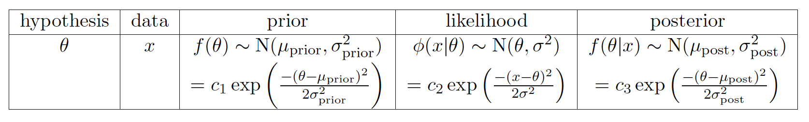
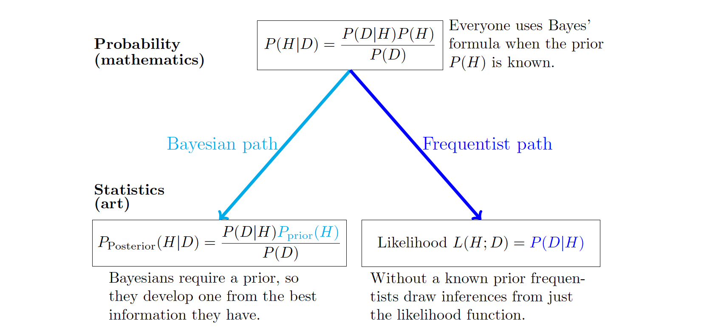

# I. Basic

Three phases: collecting data, describing data, analyzing data. We make hypotheses about what's true, collect data in experiments, describe the results, and then infer from the results the strength of the evidence concerning our hypotheses.

* Probability is more theoretical, focusing on assumed fully known random process and calculate following probabilities theoretically. The precondition is, we already know the population or we have assumption on that.
* Statistics is more practical, focusing on drawing inference from the observed data. We can assume the population follow specific kind of distribution, we have to infer the parameters using samples we have.

## Statistic

**Definition:** A statistic is anything that can be computed from the collected data, which itself is a random variable because new experiment will produce new data

> Example: the probability of rolling a 6 is not a statistic, whether or not the die is truly fair. Rather this probability is a property of the die (and the way we roll it) which we can estimate using the data. Such an estimate is given by the statistic *proportion of the rolls that were 6*.

* Point statistics: a single value computed from data, such as the sample average or the sample standard deviation
* Interval statistics: an interval  $[a: b]$ computed from the data.

## Maximum Likelihood Estimates

In practice, we usually assume the data arising from a parametric model with unknown parameters. To estimate the unknown parameter, one method is **maximum likelihood estimate**, which makes observed data have the biggest probability.

**Definition:** Given data the maximum likelihood estimate (MLE) for the parameter $p$ is the value of $p$ that maximizes the likelihood $P(data|p)$. That is, the MLE is the value of $p$ for which the data is most likely.

> Example: A coin is flipped 100 times. Given that there were 55 heads, find $p$ of head
>
> $P(55 heads)=C_{100}^{55}p^{55}(1-p)^{45}=P(55heads|p)$
>
> To find the MLE of $p$, $\frac{d}{dp}P(data|p) = 0$, then $\hat{p} = 0.55$
>
> *To make sure $\hat{p}$* is maximum, still need to check $p=0\ or\ 1$

## Log Likelihood

If is often easier to work with the natural log of the likelihood function. Since $ln(x)$ is an increasing function, the maxima of the likelihood and log likelihood coincide.

> Example1: Assume bulb light lifetime is modeled by exponential distribution and we got 5 data 2, 3, 1, 3, 4 years. Find MLE for $\lambda$
> $$
> f(x_1, x_2, x_3, x_4, x_5|\lambda) = \lambda^5 e^{-(x_1+ x_2+ x_3+ x_4+ x_5)\lambda}
> $$
> Then $f(2, 3, 1, 3, 4|\lambda) = \lambda^5 e^{-13\lambda}$, $ln(f(2, 3, 1, 3, 4|\lambda)) = 5ln(\lambda)-13\lambda$
> $$
> \frac{d}{d\lambda}(log\ likelihood) = \frac{5}{\lambda} - 13 =0 \Rightarrow \hat{\lambda} = \frac{5}{13}
> $$
> Example2: Normal distributions
> $$
> f_{X_i}(x_i) = \frac{1}{\sigma\sqrt{2\pi}}e^{-\frac{(x_i-\mu)^2}{2\sigma^2}},\ ln(f(x_1,..., x_n|\mu, \sigma)) = -nln(\sqrt{2\pi})-nln(\sigma)-\sum_{i=1}^n \frac{(x_i-\mu)^2}{2\sigma^2}
> $$
> Then
> $$
> \frac{\part{ln(f(x_1,..., x_n|\mu, \sigma))}}{\part{\mu}} = \sum_{i=1}^n \frac{(x_i-\mu)}{\sigma^2} = 0 \Rightarrow \hat{\mu} = \frac{\sum_{i=1}^n x_i}{n} = \bar{x}
> $$
>
> $$
> \frac{\part{ln(f(x_1,..., x_n|\mu, \sigma))}}{\part{\sigma}} = -\frac{n}{\sigma}+\sum_{i=1}^n \frac{(x_i-\mu)^2}{\sigma^3} = 0 \Rightarrow \hat{\sigma}^2 = \frac{\sum_{i=1}^n (x_i - \mu)^2}{n}
> $$
>
> *Why use pdf here? Actually we can add $dx$ back to the likelihood function, but the $dx$ won't affect the MLE*

## MLE Properties

* **Asymptotically unbiased**: as the amount of data grows, the mean of the MLE converges to $p$, $E(\hat{p_n}) \rightarrow p\ as \ n \rightarrow \infin$
* **Asymptotically minimal variance:** as the amount of data grows, the MLE has the minimal variance among all unbiased estimators of $p$. In symbols: for any unbiased estimator $\tilde{p_n}$ and $\epsilon >0$ we have that $Var(\tilde{p_n}) + \epsilon > Var(\hat{p_n})$ as $n \to \infin$

# II. Bayesian Updating

$$
P(H|D) = \frac{P(D|H)P(H)}{P(D)}
$$

* **Data:** the result of our experiment
* **Hypotheses:** the result we want to test
* **Prior probability:** the probability of each hypotheses prior to the experiment, e.g. $P(H)$
* **Likelihood:** the probability of data assuming the hypothesis is true, e.g. $P(D|H)$
* **Posterior probability:** the probability (posterior to) of each hypothesis given the data, e.g. $P(H|D)$
* **Bayesian updating:** the process of going from the prior probability $P(H)$ to the posterior $P(H|D)$

|            | Hypothesis |       Prior        |  Likelihood   |        Bayes numerator        |      Posterior       |
| :--------: | :--------: | :----------------: | :-----------: | :---------------------------: | :------------------: |
|            |    $H$     |       $P(H)$       |   $P(D|H)$    |         $P(D|H)P(H)$          |       $P(H|D)$       |
|  Discrete  |  $\theta$  |    $p(\theta)$     | $p(x|\theta)$ |    $p(x|\theta)p(\theta)$     |    $p(\theta|x)$     |
| Continuous |  $\theta$  | $f(\theta)d\theta$ | $p(x|\theta)$ | $p(x|\theta)f(\theta)d\theta$ | $f(\theta|x)d\theta$ |

*What's the difference with MLE?* We don't know **Prior** in MLE

## Discrete priors

If we update again and again,

### Predictive Probabilities

**Probabilistic prediction** simply means assigning a probability to each possible outcomes of
an experiment.

**Prior predictive probabilities:** These probabilities give a probabilistic prediction of what will happen after the experiment, which are calculated before collecting data

**Posterior predictive probabilities:** These probabilities give a probabilistic prediction of what will happen after the experiment again, which are computed after collecting data and updating the prior to the posterior

> *Example:* $P(D_1)$ and $P(D_2|D_1)$
>
> $P(D_1) = \sum P_{prior}P_{likelihood}$, $P(D_2|D_1) = \sum P_{posterior}P_{likelihood}$

Each hypothesis gives a different probability of heads, so the total probability of heads is a weighted average. For the prior predictive probability of heads, the weights are given by the prior probabilities of the hypotheses. For the posterior predictive probability of heads, the weights are given by the posterior probabilities of the hypotheses. Remember: Prior and posterior probabilities are for hypotheses. Prior predictive and posterior predictive probabilities are for data. 

### Odds

$O(E) = \frac{P(E)}{P(E^c)}$. For odds updating, one of our key points will be that the data can provide evidence supporting or negating a hypothesis depending on whether its posterior odds are greater or less than
its prior odds.

**Example:** Marfan syndrome

The prior odds: $O(M) = P(M)/P(M^c) = 1/14999 = 0.000067$

If a person has at least one of these ocular features, the posterior adds:

$O(M|F) = \frac{P(M|F)}{P(M^c|F)} = \frac{P(F|M)P(M)}{P(F|M^c)P(M^c)} = 0.000667$

### Bayes factors and strength of evidence

For a hypothesis H and data D, the Bayes factor is the ratio of the likelihoods:

**Bayes factor** $= \frac{P(D|H)}{P(D|H^c)}$

$O(H|D) = \frac{P(H|D)}{P(H^c|D)} = \frac{P(D|H)P(H)}{P(D|H^c)P(H^c)} = \frac{P(D|H)}{P(D|H^c)}  O(H)$

So posterior odds = **Bayes factor** * prior odds

> Example: Two traces of blood, O(60% in population) and AB(1% in population), left at the scene of a crime. Alan has O blood, Bob has AB blood. How's the evidence of data in terms of 2 people's suspicion?
>
> $BF_A = \frac{P(D|H_A)}{P(D|H_A^c)} = \frac{0.01}{2 \times0.6\times0.01}=0.83 <1$
>
> $BF_B = \frac{P(D|H_B)}{P(D|H_B^c)} = \frac{0.6}{2 \times0.6\times0.01}=50\gg1$

### Bayes factors updating

**Conditionally independent:** $P(D_1, D_2|H) = P(D_1|H)P(D_2|H)$ if holds for every hypothesis.

So $O(H|D_1, D_2) = \frac{P(D_1, D_2|H)}{P(D_1, D_2|H^c)}O(H) = BF_2 \cdot BF_1 \cdot O(H)$

**Log odds:** $ln(O(H|D_1, D_2)) = ln(BF_2)+ ln(BF_1) + ln(O(H))$

## Continuous Priors

**Law of total probability:** $p(x) = \int_a^b p(x|\theta) f(\theta)d\theta$

**Bayes theorem:** $f(\theta|x) = \frac{p(x|\theta)f(\theta)}{p(x)} = \frac{p(x|\theta)f(\theta)}{\int_a^b p(x|\theta) f(\theta)d\theta}$

### Continuous updating

**Example:** A bent coin with unknow probability $\theta$ of heads. The value of $\theta$ is random with prior pdf $f(\theta) = 2\theta$.

### Predictive probabilities

**Followed example:**

Prior predictive probability: $p(x_1=1) = \int_0^1 p(x_1=1|\theta) f(\theta) d\theta = \frac{2}{3}$

Posterior predictive probability: 

$p(x_2=1|x_1=1) = \int_0^1 p(x_2=1|\theta, x_1=1) f(\theta|x_1=1) d\theta = \int_0^1 \theta \cdot3\theta^2d\theta = 3/4$

### Continuous Data with Continuous Priors

*Here we usually drop $dx$ because data $x$ is fixed in each calculation.*

**Example:** Normal hypothesis and normal data

Suppose $x \sim N(\theta, 1)$ and $\theta \sim N(2, 1)$, we draw a $x$ with value 5.

Here we don't need to really calculate $c_1 c_2$, because the posterior pdf is still normal. We can infer that $\mu = 7/2$ and $\sigma^2=1/2$ 

**Prior predictive pdf:** $\phi(x) = \int \phi(x|\theta)f(\theta)d\theta$

**Posterior predictive pdf:**  $\phi(x_2|x_1) = \int \phi(x_2|\theta, x_1)f(\theta|x_1)d\theta = \int \phi(x_2|\theta)f(\theta|x_1)d\theta$

*Because $x_1$ and $x_2$ are **conditionally independent** so that $\phi(x_2|\theta, x_1) = \phi(x_2|\theta)$*

## Conjugate priors

### Beta distribution

$f(\theta) = \frac{(a+b-1)!}{(a-1)!(b-1)!} \theta^{a-1}(1-\theta)^{b-1}$

**Example:** If a bent coin ~ $Bernoulli(\theta)$, $f(\theta)=1$, We toss it 12 times and get 8 heads and 4 tails.

If toss this coin again getting n heads and m tails, then $f(\theta|x_1, x_2) \sim Beta(9+n, 5+m)$

The beta distribution is called a **conjugate prior** for the binomial distribution. This means that if the likelihood function is binomial, then a beta prior gives a beta posterior. In fact, the beta distribution is a conjugate prior for the Bernoulli and geometric distributions as well.

*The flat prior is actually $Beta(1, 1)$*

Suppose the likelihood follows a $binomial(N, \theta)$ distribution:

### Normal distribution

The normal distribution is its own conjugate prior. In particular, if the likelihood function is **normal with known variance**, then a normal prior gives a normal posterior.

Suppose a measurement $x\sim N(\theta, \sigma^2)$ where the variance is known, for the unknown parameter $\theta$ we have $f(\theta) \sim N(\mu_{prior}, \sigma^2_{prior})$, then:

The posterior pdf is also normal $f(\theta|x) \sim N(\mu_{post}, \sigma^2_{post})$ where
$$
\frac{1}{\sigma^2_{post}} = \frac{1}{\sigma^2_{prior}}+\frac{1}{\sigma^2},\ \frac{\mu_{post}}{\sigma^2_{post}} = \frac{\mu_{prior}}{\sigma^2_{prior}} + \frac{x}{\sigma^2}
$$
The above equations can be written as:
$$
a=\frac{1}{\sigma^2_{prior}}, b=\frac{1}{\sigma^2}, \mu_{post} = \frac{a\mu_{prior} + bx}{a+b}, \sigma^2_{post} = \frac{1}{a+b}
$$
So that $\mu_{post}$ is a weighted average between $\mu_{prior}$ and the data $x$. If b is very large (that is, if the data has a tiny variance) then most of the weight is on the data. If a is very large (that is, if you are very confident in your prior) then most of the weight is on the prior. (the post variance is smaller than both data variance and prior variance)

If we get multi data points, 
$$
\frac{1}{\sigma^2_{post}} = \frac{1}{\sigma^2_{prior}}+\frac{n}{\sigma^2},\ \frac{\mu_{post}}{\sigma^2_{post}} = \frac{\mu_{prior}}{\sigma^2_{prior}} + \frac{n\bar{x}}{\sigma^2},\ \bar{x} = \frac{x_1+...+ x_n}{n} \\

a=\frac{1}{\sigma^2_{prior}}, b=\frac{n}{\sigma^2}, \mu_{post} = \frac{a\mu_{prior} + b\bar{x}}{a+b}, \sigma^2_{post} = \frac{1}{a+b}
$$

- Normal-normal: variance always decreases with data.
- Beta-binomial: variance usually decreases with data. (might increase)

## Choosing priors

**Bayesian**: Bayesians make inferences using the posterior $P(H|D)$, and therefore always need a prior $P(H)$. If a prior is not known with certainty the Bayesian must try to make a reasonable choice. 

**Frequentist**: Very briefly, frequentists do not try to create a prior. Instead, they make inferences using the likelihood $P(D|H)$.

Benefits of Bayesian:

- The posterior probability $P(H|D)$ for the hypothesis given the evidence is usually exactly what we'd like to know. The Bayesian can say something like '*the parameter of interest has probability 0.95 of being between 0.49 and 0.51.*' (more intuitive)
- The assumptions that go into choosing the prior can be clearly spelled out.

## Probability intervals

A p-probability interval for $\theta$ is an interval $[a,b]$ with $P(a\le\theta\le b) =p$. Here we can call it probability interval or credible interval, but not confidence interval.

# III. Frequentist

## Comparison

**Frequentist** refers to the idea that probabilities represent long-term frequencies of repeatable random experiments. This means the frequentist finds it nonsensical to specify a probability distribution for a parameter with a fixed value. While Bayesians are happy to use probability to describe their incomplete knowledge of a fixed parameter, frequentists reject the use of probability to quantify degree of belief in hypotheses.

**Bayesians** put probability distributions on everything (hypotheses and data), while frequentists put probability distributions on (random, repeatable, experimental) data given a hypothesis. For the frequentist when dealing with data from an unknown distribution only the likelihood has meaning. The prior and posterior do not.

- **Statistic**: anything that can be computed from data.
- **Sampling distribution**: the probability distribution of a statistic

> [Likelihood Principle](https://en.wikipedia.org/wiki/Likelihood_principle): if the data are the same in both cases, the inferences drawn about the value of $\theta$ should also be the same. That true in Bayes but not in frequentist. Because the outcome of frequentist depends on the experimental procedure, it uses the probabilities of unseen data as well as those of the actually observed data.
>
> *Different stop rule can cause different result in NHST even we got same experiement data. Because the likelihood function depends on the experiment design which can derive different distributions.*

### Bayesian

**Critique of Bayesian:**

1. Different people will produce different priors and may therefore arrive at different posteriors and conclusions.
2. There are philosophical objections to assigning probabilities to hypotheses, as hypotheses do not constitute outcomes of repeatable experiments in which one can measure long-term frequency.

**Defense of Bayesian:**

1. The probability of hypotheses is exactly what we need to make decisions.
2. Using Bayes' theorem is logically rigorous. Once we have a prior all our calculations have the certainty of deductive logic.
3. The evidence derived from the data is independent of notions about *data more extreme* that depend on the exact experimental setup
4. Data can be used as it comes in. There is no requirement that every contingency be planned for ahead of time.

### Frequentist

**Critique of frequentist:**

1. It is ad-hoc and does not carry the force of deductive logic. Notions like *data more extreme* are not well defined. The p-value depends on the exact experimental setup
2. Experiments must be fully specied ahead of time.
3. The p-value and signicance level are notoriously prone to misinterpretation. E.g. the significant level is 5% means if the null hypothesis is true then 5% of the time it will be rejected due to randomness.

**Defense of frequentist:**

1. It is objective
2. Frequentist experimental design demands a careful description of the experiment and methods of analysis before starting. This helps control for experimenter bias.

## Null Hypothesis Significance Testing

- $H_0$: the null hypothesis, usually a cautious default assumption for the model generating the data.
- $H_A$: the alternative hypothesis, which is extreme under the null hypothesis
- $X$: the test statistic computed from the data, which is a random variable can be get from a repeatable trial
- Null distribution: the probability distribution of $X$ assuming $H_0$
- Simple hypothesis: which we can specify its distribution completely. A typical simple hypothesis is that a parameter of interest takes a specific value.
- Composite hypotheses: If its distribution cannot be fully specified, we say that the hypothesis is composite. A typical composite hypothesis is that a parameter of interest lies in a range of values.
- Significance level: $P(reject\ H_0|H_0) = P(Type\ I\ error)$
- Power: $P(reject\ H_0|H_a) = 1-P(Type\ II\ error)$

We could only say *reject* or *not reject* the null hypothesis, whereas *accept* $H_0$ is wrong. This is often summarized by the statement: *you can never prove the null hypothesis*. A **significance level** of 0.05 does not mean the test only makes mistakes 5% of the time. It means that if the null hypothesis is true, then the probability the test will mistakenly reject it is 5%.

### Design a NHST

1. Design an experiment to collect data and choose a test statistic $x$ to be computed from the data. The key requirement here is to know the null distribution $f(x|H_0)$. To compute power, one must also know the alternative distribution $f(x|H_A)$.
2. Decide if $H_A$ one-sided or two-sided
3. Choose a significance level $\alpha$ for rejecting the null hypothesis. If applicable, compute the corresponding power of the test.
4. Run the experiment to collect data $x_1, x_2, ..., x_n$
5. Compute the test statistic $x$
6. Compute the p-value corresponding to $x$ using the null distribution
7. If $p<\alpha$, reject the null hypothesis in favor of the alternative hypothesis

**p-value** is the probability, assuming the null hypothesis, of seeing data at least as extreme as the experimental data. Depends on one-sided or two-sided.

$p = P(data\ at\ least\ as\ extreme\ as\ what\ we\ got|H_0)$

**The main purpose of significance testing is to use sample statistics to draw conclusions about population parameters. **

## Z-test

* Use: Test if the population mean equals a hypothesized mean.
* Data: $x_1, x_2, ..., x_n \sim N(\mu, \sigma)$, where **$\mu$ is unknown and $\sigma$ is known**
* Test statistic: $z = \frac{\bar{x} - \mu_0}{\sigma/\sqrt{n}}$ which is the standardized mean
* Null hypothesis: $f(z|H_0)$ follows the pdf $Z \sim N(0, 1)$
* $p = P(Z>z|H_0)$ or $p = P(Z<z|H_0)$ or $p = P(|Z| > |z|)$

## T-test

The [t-distribution](https://en.wikipedia.org/wiki/Student's_t-distribution) is symmetric and bell-shaped like the normal distribution. It has a parameter $df$ which stands for degrees of freedom. For df small the t-distribution has more probability in its tails than the standard normal distribution. As df increases $t(df)$ becomes more and more like the standard normal distribution.

### One-sample t-test

For z-test, we know the variance $\sigma^2$. However mostly we don't know $\sigma$ and we have to estimate that.

* Use: Test if the population mean equals a hypothesized mean.
* Data: $x_1, x_2, ..., x_n \sim N(\mu, \sigma)$, where **$\mu$ and $\sigma$ are both unknown**
* Test statistic: $t = \frac{\bar{x} - \mu_0}{s/\sqrt{n}}$ which is the studentized mean, sample variance $s^2 = \sum_{i=1}^n(x_i-\bar{x})^2 / (n-1)$
* Null hypothesis: $f(t|H_0)$ follows the pdf $T\sim t(n-1)$, the t-distribution with n-1 degrees of freedom

>T-distribution can be defined as $T=\frac{Z}{\sqrt{V/v}}$, where $Z\sim N(0,1)$, $V$ follows chi-squared distribution with $v \ df$, and they are independent.
>
>Then let $V=(n-1)\frac{S_n^2}{\sigma^2}, Z=\frac{\bar{X_n}-\mu}{\sigma/\sqrt{n}}$, we'll get $T=\frac{\bar{X_n}-\mu}{S_n/\sqrt{n}}$

### Two-sample t-test

* Use: Test if the population means from **two populations** differ by a hypothesized amount.
* Data: Assume 2 normal distributions have **same variance**, $x_1, x_2, ..., x_n \sim N(\mu_1, \sigma)$, $y_1, y_2, ..., y_m \sim N(\mu_2, \sigma)$, where **$\mu_1$, $\mu_2$ and $\sigma$ are all unknown**
* $H_0$: For a specific $\mu_0: \mu_x - \mu_y = \mu_0$
* Test statistic: $t = \frac{\bar{x}-\bar{y} - \mu_0}{s_p}$, the pooled variance $s_p^2 = \frac{(n-1)s_x^2+(m-1)s_y^2}{n+m-2}(\frac{1}{n}+\frac{1}{m})$, if $n=m$, $s_p^2 = \frac{s_x^2 + s_y^2}{n}$ 
* Null hypothesis: $f(t|H_0)$ follows the pdf $T\sim t(n+m-2)$

*when the variances are not assumed equal, use Welch's t-test.*

### Paired two-sample t-test

* Use: Test if the average difference between paired values in a population equals a hypothesized value.
* Data: $x_1, ..., x_n$ and $y_1, ..., y_n$ must have same length
* Assumption: $w_i = x_i - y_i \sim i.i.d. N(\mu, \sigma)$,  where **$\mu$ and $\sigma$ are both unknown**
* Then just do one-sample t-test using $w$

## F-test

### Equality of 2 variances

* Use: Test for the null hypothesis that two normal populations have the same variance
* Assumption: Data from each group follows independent normal distribution (means can be different)
* Test statistic: $F = S_X^2/S_Y^2 \sim F(n-1, m-1)$

### One-way ANOVA

* Use: Test if the population means from n groups are all the same.
* Data: n groups * m samples per group
* Assumptions: Data from each group follows independent normal distribution with **(possibly) different means but the same variance**
* Test statistic: $w = \frac{MS_B}{MS_W}$, where $MS_B = \frac{m}{n-1}\sum_{i=1}^n(\bar{x}_i - \bar{x})^2$, $MS_W = \frac{s_1^2+...+s_n^2}{n}$. If all $\mu_i$ are equal, then this ratio should be near 1
* Null distribution: $f(w|H_0)$ follows pdf $W \sim F(n-1, n(m-1))$

> Why don't we just perform multi t-test? 
>
> T-test can do 2-sample means each time, but if we do multi times, the type I error will inflate. For example, if significant level 5%, we do many t-tests for 20 sample means, then there must be a few times we reject null hypothesis. But one-way ANOVA can control the whole type I error in low level.

## Chi-square test

> The Chi-square distribution with k degrees of freedom is the distribution of a sum of the squares of k independent standard normal random variables.
>
> $Z_1, ... ,Z_k i.i.d. Normal, X^2 = \sum_{i=1}^k Z_i^2 \sim \chi^2(k)$

### For goodness of fit

This is a test of how well a hypothesized probability distribution fits a set of data. The test statistic is called a chi-square statistic and the null distribution associated of the chi-square statistic is the chi-square distribution. It is denoted by $\chi^2(df)$.

* Use: Test whether discrete data fits a specific finite probability mass function. 
* Data: An observed count $O_i$ for each possible outcome $\omega_i$
* Test statistic: Pearson's chi-square statistic $X^2 = \sum \frac{(O_i - E_i)^2}{E_i}$

### For homogeneity

* Use: Test whether $m$ different independent sets of discrete data are drawn from the same distribution.
* Data: $m$ independent sets of data, count $O_{ij}$ for possible outcome $\omega_j$
* Null distribution: $\chi^2(df), df = (m-1)(n-1)$

### For single variance

* Use: Test whether the variance of a population is equal to a specified value
* Test statistic: $T=(n-1)(\frac{s}{\sigma_0})^2 \sim \chi^2(n-1)$

## Confidence intervals

An interval statistic is a pair of point statistics giving the lower and upper bounds of the interval. The interval itself is a random variable which doesn't depend on the value of an unknown parameter or hypothesis.

**Caution:** A 95% confidence interval is defined as a range of values such that with 95% probability, the range will contain the true unknown value of the parameter, which means we take n samples again and again, 95% confidence intervals will cover the real value. It can not be expressed as the true parameter has 95% probability to be in the confidence interval because the confidence interval is a random variable whereas the true parameter not.

### Z confidence intervals

Suppose the data $x_1, ..., x_n \sim N(\mu, \sigma^2)$ with unknown mean but known variance. Then the $(1-\alpha)$ confidence interval for $\mu$ is:
$$
[\bar{x} - \frac{z_{\alpha/2} \cdot \sigma}{\sqrt{n}}, \bar{x} + \frac{z_{\alpha/2} \cdot \sigma}{\sqrt{n}}]
$$
**Pivoting:** $\bar{x}$ is in $\mu_0 \pm a$ says exactly the same thing as $\mu_0$ is in $\bar{x} \pm a$

 ### T confidence intervals

Suppose the data $x_1, ..., x_n \sim N(\mu, \sigma^2)$ with unknown mean and unknown variance. Then the $(1-\alpha)$ confidence interval for $\mu$ is:
$$
[\bar{x} - \frac{z_{\alpha/2} \cdot s}{\sqrt{n}}, \bar{x} + \frac{z_{\alpha/2} \cdot s}{\sqrt{n}}]
$$

### Chi-square confidence intervals

Suppose the data $x_1, ..., x_n \sim N(\mu, \sigma^2)$ with unknown mean and unknown variance. Then the $(1-\alpha)$ confidence interval for the variance $\sigma^2$ is:
$$
[\frac{(n-1)s^2}{c_{\alpha/2}}, \frac{(n-1)s^2}{c_{1-\alpha/2}}]
$$
